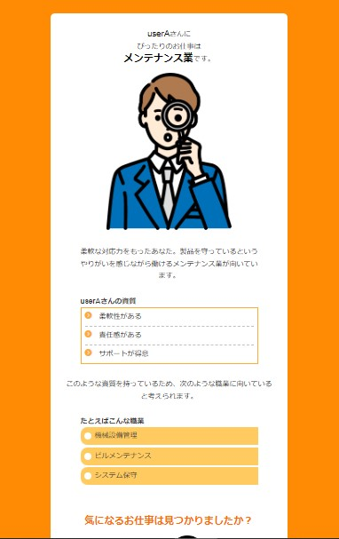

# 適職診断

## 目次

1. [プロジェクトについて](#プロジェクトについて)
2. [環境](#環境)
3. [デモ画面](#デモ画面)
4. [開発環境構築](#開発環境構築)

<!-- プロジェクトについて -->

## プロジェクトについて
SBキャリアカレッジ梅田校「Javaプログラマー養成科」の授業の一環として
ジョブリッジ企業実習を実施。
求職者が自分の適性を活かした職業を知ることができる
適職診断のWEBアプリを作成しました。

(<a href="#top">トップへ</a>)

## 環境
<!-- シールド一覧 -->
<!-- 該当するプロジェクトの中から任意のものを選ぶ-->

  <!-- バックエンドの言語一覧 -->
  

<!-- 言語、フレームワーク、ミドルウェア、インフラの一覧とバージョンを記載 -->
- バックエンド
    - java
    - H2 Database
- フロントエンド
    - HTML
    - CSS

(<a href="#top">トップへ</a>)

## デモ画面
 
【トップ画面】診断結果や表示に使用するニックネームを入力 

 
【質問画面】はいorいいえの二択問題を表示。回答によって次の質問が変わる 

 
【診断結果画面】回答から適職を導きだし表示。資質や具体的な職種を提案。  

(<a href="#top">トップへ</a>)

## 開発環境構築

(<a href="#top">トップへ</a>)
